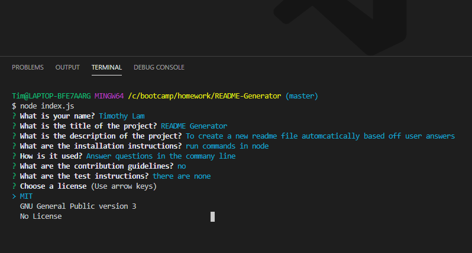

# README Generator

## Description

This README generator is a CLI app that will automatically create a new README file based upon user input. A series of prompts will be asked and the answers will be used to render a quality README file.

## Skills showcased

Node.js
Inquirer
Promises
Asynchronous functions
String interpolation and template literals

## What the app looks like

